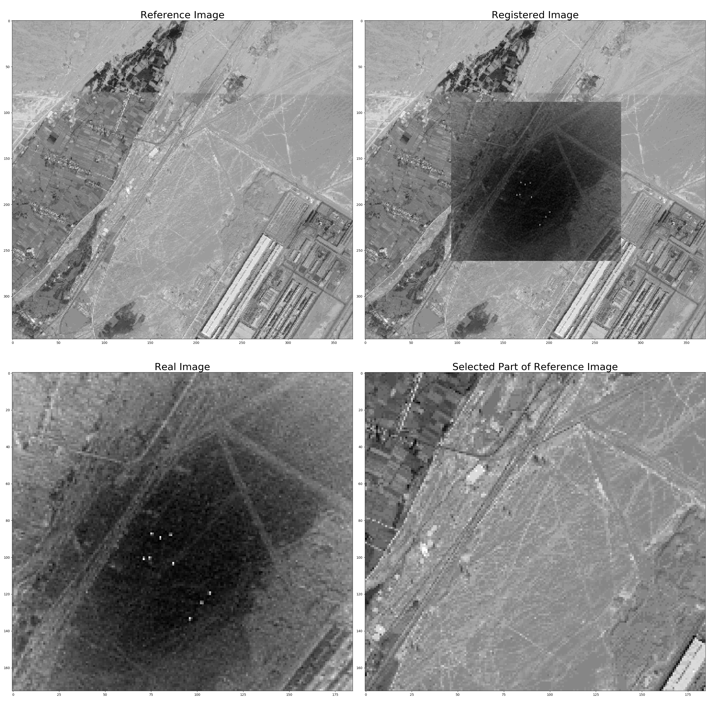

# Image Registration
+ Image I: Reference image
+ Image J: Real Image



# Requirements
+ Python3
+ Opencv-python
+ Opencv-contrib-python
+ scikit_image
+ scipy
+ numpy
+ matplotlib
+ Pillow

# Usage
```python
python reg.py
```
For more details, you can see `demo.ipynb`.
